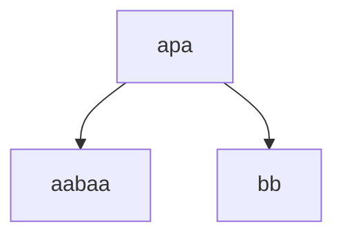
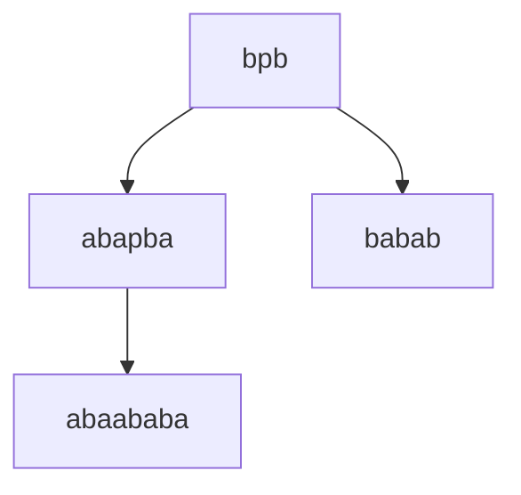
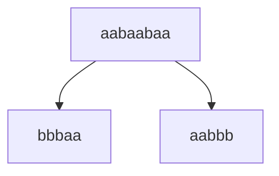
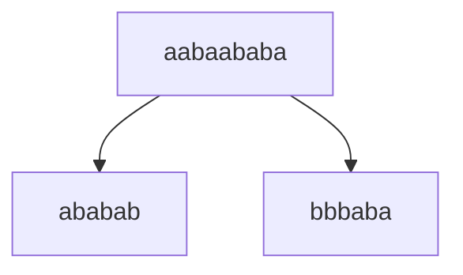
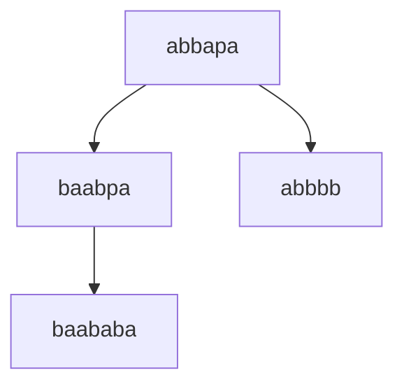
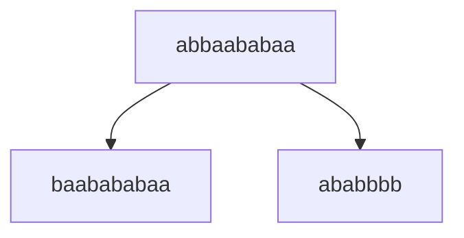

# Лабораторная работа №1
## Задание:  
По имеющейся **SRS** T определить: 
- завершимость
- конечность классов эквивалентности по НФ (для построения эквивалентностей считаем, что правила могут применяться в обе стороны). Если их конечное число, то построить минимальную систему переписывания, им соответствующую.
- локальную конфлюэнтность и пополняемость по Кнуту-Бендиксу  

### 1. Докажем завершимость
Система переписывания T:
* $\texttt{bpb} \to \texttt{abapba}$
* $\texttt{p} \to \texttt{aba}$
* $\texttt{apa} \to \texttt{bb}$
* $\texttt{abba} \to \texttt{baab}$

#### Рассмотрим функцию $$F_1(w) := |w|_{p}$$
(количество вхождений символа $p$ в слово $w$)

$F_1$ убывает при применении правил $\texttt{p} \to \texttt{aba}$ и $\texttt{apa} \to \texttt{bb}$, правило $\texttt{bpb} \to \texttt{abapba}$ можно рассмотреть как:
$\texttt{bpb} \to \texttt{abaababa}$, тогда $F_1$ не меняется только при применении $\texttt{abba} \to \texttt{baab}$  

Для определения фундированного порядка введём лексикографический порядок над $\Sigma^*$. 

#### Рассмотрим функцию $$F_2(w) := |w|_{bp}$$ 
(количество вхождений подстроки $bp$ в слово $w$)

$F_2$ строго убывает при применении правила $\texttt{bpb} \to \texttt{abapba}$, при применении остальных правил $F_2(LHS) = F_2(RHS)$.

#### Определим функцию $F_3: \Sigma^* \to \mathbb{N}$ и пусть 

$
f(a) := 1, f(b) := 0, f(p) := +∞
$
Воспринимаем любое слово в виде двоичного числа, а после переводим его в десятичную систему (избавление от p должно быть в приоритете).

Это позволяет нам рассмотреть отдельно оставшееся правило $\texttt{abba} \to \texttt{baab}$, так как $F_1$ и $F_2$ не меняют своего значения. 

Таким образом, определяем лексикографический порядок через отображение $F: \Sigma^* \to \mathbb{N}^3$ 

$$
F(w) := (F_1, F_2, F_3)
$$

Изначально рассматриваем количество вхождений символа $p$, при равенстве рассматриваем количество вхождений подстроки $bp$, при условии равенства вхождений и это подстроки, рассматриваем вес слова в двоичной системе. 

Для каждого правила $F(LHS) > F(RHS)$, значит, **система завершима**

### 2. Классы эквивалентности по НФ

Число нормальных форм **бесконечно**: примерами будут $a^*$, $b^*$, $(ab)^*(a|b)$, $(ba)^*(a|b)$, $(aba)^*$.  

### 3. Локальная конфлюэнтность

Рассмотрим слово $w = $apa$, содержащее в себе критическую пару. 

$w \to v_1, v_1 = aabaa$ при применении правила $\texttt{p} \to \texttt{aba}$
$w \to v_2, v_2 = bb$ при применении правила $\texttt{apa} \to \texttt{bb}$. 

**Локальной конфлюэнтности нет**, так как $v_1$ и $v_2$ являются нормальными формами (не содержат редексов).

### 4. Пополняемость по Кнуту-Бендиксу
По алгоритму Кнута-Бендикса критическими будут следующие пары: $bpb$, $apa$

В критической паре $bpb$ из правил $\texttt{p} \to \texttt{aba}$ и $\texttt{bpb} \to \texttt{abapba}$:

добавляем правило $\texttt{abaababa} \to \texttt{babab}$

В критической паре $apa$ из правил $\texttt{p} \to \texttt{aba}$ и $\texttt{apa} \to \texttt{bb}$:

добавляем правило $\texttt{aabaa} \to \texttt{bb}$

Возникли новые критические пары $aabaababa$, $aabaabaa$, $abbapa$

В критической паре $aabaabaa$ из правила $\texttt{aabaa} \to \texttt{bb}$:

добавляем правило $\texttt{bbbaa} \to \texttt{aabbb}$

В критической паре $aabaababa$ из правил $\texttt{aabaa} \to \texttt{bb}$ и $\texttt{abaababa} \to \texttt{babab}$:

добавляем правило $\texttt{ababab} \to \texttt{bbbaba}$

Рассмотрим теперь критическую пару $abbapa$:

Используем правила $\texttt{aabaa} \to \texttt{bb}$, $\texttt{apa} \to \texttt{bb}$ и $\texttt{abba} \to \texttt{baab}$:

добавляем правило $\texttt{baababa} \to \texttt{abbbb}$

Оно формирует критическую правилу с правилом $\texttt{abba} \to \texttt{baab}$:

Новое правило, извлеченное из этой крит. пары, будет также формировать крит. пару с правилом $\texttt{abba} \to \texttt{baab}$. Таким образом, алгоримт Кнута-Бендикса будет бесконечно добавлять правила вида:

$$
baa(ba)^{n+1}baa \to (ab)^nabbbb
$$

Пополнить систему конечным числом правил нельзя, значит система **непополянема по алгоритму Кнута-Бендикса**. 

### 5. Инварианты

1. $|w|_{p}$ - монотонная функция
2. $|w|_{b}$ - монотонная функция
3. $(|a| + |b|)mod 3$