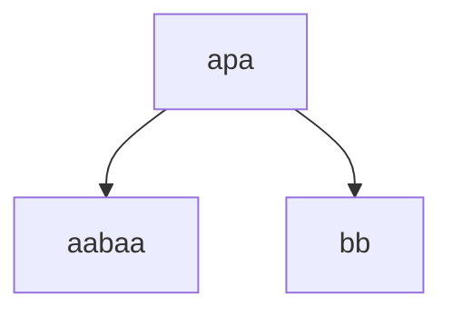
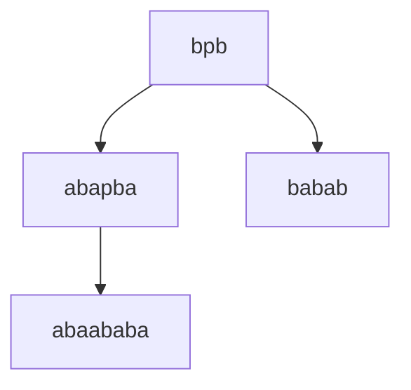
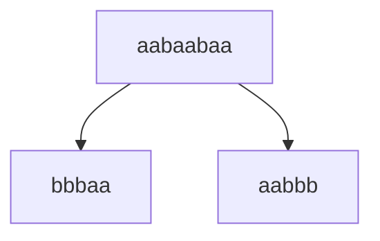
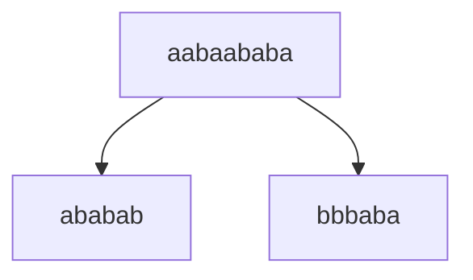
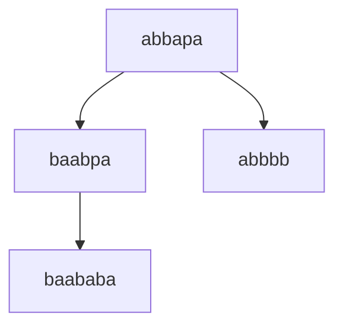
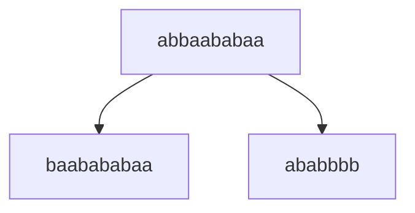

# Лабораторная работа №1
## Задание:  
По имеющейся **SRS** T определить: 
- завершимость
- конечность классов эквивалентности по НФ (для построения эквивалентностей считаем, что правила могут применяться в обе стороны). Если их конечное число, то построить минимальную систему переписывания, им соответствующую.
- локальную конфлюэнтность и пополняемость по Кнуту-Бендиксу  

### 1. Докажем завершимость
Система переписывания T:
* $\texttt{bpb} \to \texttt{abapba}$
* $\texttt{p} \to \texttt{aba}$
* $\texttt{apa} \to \texttt{bb}$
* $\texttt{abba} \to \texttt{baab}$

#### Рассмотрим правила $\texttt{p} \to \texttt{aba}$ и $\texttt{apa} \to \texttt{bb}$
(количество вхождений символа $p$ в слово $w$)

Количество $p$ убывает при применении правил $\texttt{p} \to \texttt{aba}$ и $\texttt{apa} \to \texttt{bb}$, значит каждое из этих правил не может быть применимо более $|w|_p$ раз, поэтому бесконечная цепочка при их применении возникнуть не может.

#### Рассмотрим правило $\texttt{bpb} \to \texttt{abapba}$
Рассмотрим $w_1bpbw_2$. Применяя правило 4 к $w_1$, и применяя правило 1 к $bpb$, можно получить $b$ слева от оставшегося $bp$.

$$ abbbpb \to abbabapba \to baabbapba \to babaabpba \to babaaabapbaa $$

После второго применения правила $bpb$ к рассматриваемой $p$ перед ней возникает подстрока $aaba$. Для того, чтобы применить к указанной $p$ правило 1 ещё раз, нужно, чтобы из $aaba$ мы могли получить $abba$, а это невозможно сделать ни при каком применении правил 2, 3 и 4. Значит, правило 1 к одной и той же $p$ можно применить лишь конечное число раз. Данное правило уменьшает количество подстрок $bbb$, а правило 4 затем уменьшает количество подстрок $bb$ за конечное число шагов.

#### Рассмотрим правило $\texttt{abba} \to \texttt{baab}$

$a = 1$
$b = 0$

$\texttt{abba} \to 1001$ и $\texttt{baab} \to 0110$

Тогда $21 \to 12$, значит $F(LHS) > F(RHS)$. Происходит сортировка в строке $w$ пар $ab$ и $ba$, где позиции $ba$ уменьшаются

### 2. Классы эквивалентности по НФ

Число нормальных форм **бесконечно**: примерами будут `a*`, `b*`, `(ab)*(a|b)`, `(ba)*(a|b)`, `(aba)*`.

### 3. Локальная конфлюэнтность

Рассмотрим слово $w = apa$, содержащее в себе критическую пару.

$w \to v_1, v_1 = aabaa$ при применении правила $\texttt{p} \to \texttt{aba}$
$w \to v_2, v_2 = bb$ при применении правила $\texttt{apa} \to \texttt{bb}$. 

**Локальной конфлюэнтности нет**, так как $v_1$ и $v_2$ являются нормальными формами (не содержат редексов).

### 4. Пополняемость по Кнуту-Бендиксу
По алгоритму Кнута-Бендикса критическими будут следующие пары: $bpb$, $apa$

В критической паре $bpb$ из правил $\texttt{p} \to \texttt{aba}$ и $\texttt{bpb} \to \texttt{abapba}$:

добавляем правило $\texttt{abaababa} \to \texttt{babab}$

В критической паре $apa$ из правил $\texttt{p} \to \texttt{aba}$ и $\texttt{apa} \to \texttt{bb}$:

добавляем правило $\texttt{aabaa} \to \texttt{bb}$

Возникли новые критические пары $aabaababa$, $aabaabaa$, $abbapa$

В критической паре $aabaabaa$ из правила $\texttt{aabaa} \to \texttt{bb}$:

добавляем правило $\texttt{bbbaa} \to \texttt{aabbb}$

В критической паре $aabaababa$ из правил $\texttt{aabaa} \to \texttt{bb}$ и $\texttt{abaababa} \to \texttt{babab}$:

добавляем правило $\texttt{ababab} \to \texttt{bbbaba}$

Рассмотрим теперь критическую пару $abbapa$:

Используем правила $\texttt{aabaa} \to \texttt{bb}$, $\texttt{apa} \to \texttt{bb}$ и $\texttt{abba} \to \texttt{baab}$:

добавляем правило $\texttt{baababa} \to \texttt{abbbb}$

Оно формирует критическую пару с правилом $\texttt{abba} \to \texttt{baab}$:

Новое правило, извлеченное из этой критической пары, будет также формировать критическую пару с правилом $\texttt{abba} \to \texttt{baab}$. Таким образом, алгоритм Кнута-Бендикса будет бесконечно добавлять правила вида:

$$
baa(ba)^{n+1}baa \to (ab)^nabbbb
$$

Пополнить систему конечным числом правил нельзя, значит система **непополянема по алгоритму Кнута-Бендикса**. 

### 5. Инварианты
1. $(|a| + |b|) mod 3$ - инвариант
2. $|w|_{p}$ - монотонная функция
3. $|w|_{b}$ - монотонная функция 