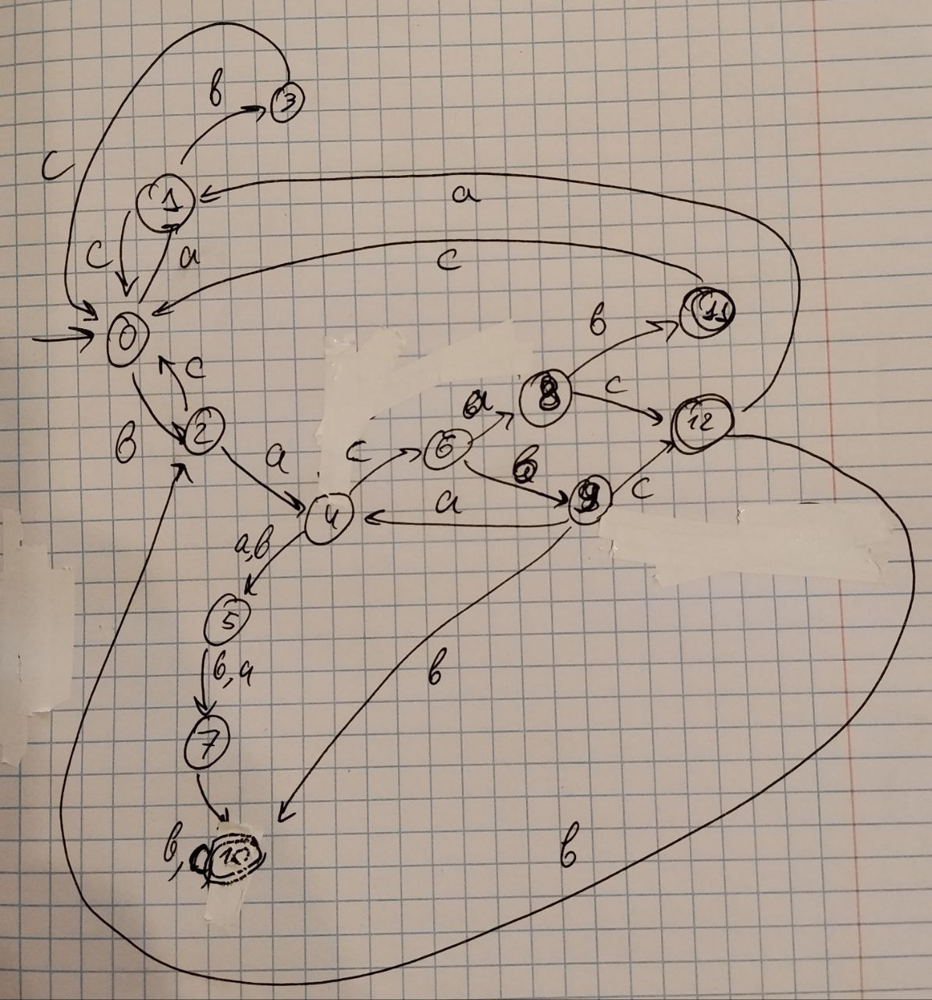

# Лабораторная работа №2

## Задание: 

По имеющемуся академическому регулярному выражению построить:

1. Минимальный ДКА, распознающий ее язык (минимальность обосновать таблицей классов эквивалентности)
2. Возможно малый НКА, возможно малый ПКА, распознающий ее язык (частично обосновать через таблицы множеств классов эквивалентности)
3. Расширенное регулярное выражение, распознающее тот же язык
4. Провести автоматическое тестирование предполагаемой эквивалентности

Выражение: $(abc|bc|ac|bac)^*ba(a|b|c)(a|b)(b|c)$

### 1. Построить ДКА и обосновать минимальность через таблицу классов эквивалентности

Построенный ДКА на 13 состояний:

Таблица классов эквивалентности:

|        | ε | c | bb | bbc | cbabab | acbaabc | bcbaabc |
|--------|---|---|----|-----|--------|---------|---------|
| ε      | 0 | 0 | 0  | 0   | 0      | 1       | 1       |
| a      | 0 | 0 | 0  | 0   | 1      | 0       | 1       |
| b      | 0 | 0 | 0  | 0   | 1      | 1       | 0       |
| ab     | 0 | 0 | 0  | 0   | 1      | 0       | 0       |
| ba     | 0 | 0 | 0  | 1   | 1      | 0       | 0       |
| bac    | 0 | 0 | 1  | 0   | 0      | 1       | 1       |
| bab    | 0 | 0 | 1  | 0   | 0      | 0       | 0       |
| bacb   | 0 | 1 | 0  | 0   | 1      | 1       | 0       |
| baca   | 0 | 1 | 0  | 0   | 1      | 0       | 1       |
| babb   | 0 | 1 | 0  | 0   | 0      | 0       | 0       |
| bacab  | 1 | 0 | 0  | 0   | 1      | 0       | 0       |
| bacac  | 1 | 0 | 0  | 0   | 0      | 1       | 1       |
| bacbb  | 1 | 0 | 0  | 0   | 0      | 0       | 0       |

### 2. НКА

Построенный НКА на 8 состояний. Недетерминизм возникает при обработке части $ba$, которая может быть в конце при $baXYZ$ и входить в $(bac|bc|ac|abc)^*$

Можно обосновать минимальность построенного НКА таблицей: 

|       | ε | c | bb | abc | aaac | babbb | cbaaab | bcbacac |
|-------|---|---|----|-----|------|-------|--------|---------|
| a     | 0 | 0 | 0  | 0   | 0    | 0     | 1      | 1       |
| b     | 0 | 0 | 0  | 0   | 1    | 0     | 1      | 0       |
| ab    | 0 | 0 | 0  | 0   | 0    | 0     | 1      | 0       |
| ba    | 0 | 0 | 0  | 1   | 0    | 0     | 1      | 0       |
| ac    | 0 | 0 | 0  | 0   | 0    | 1     | 0      | 1       |
| baa   | 0 | 0 | 1  | 0   | 0    | 0     | 0      | 0       |
| babb  | 0 | 1 | 0  | 0   | 0    | 0     | 0      | 0       |
| bacac | 1 | 0 | 0  | 0   | 0    | 1     | 0      | 1       |

### 3. ПКА

Построим ПКА