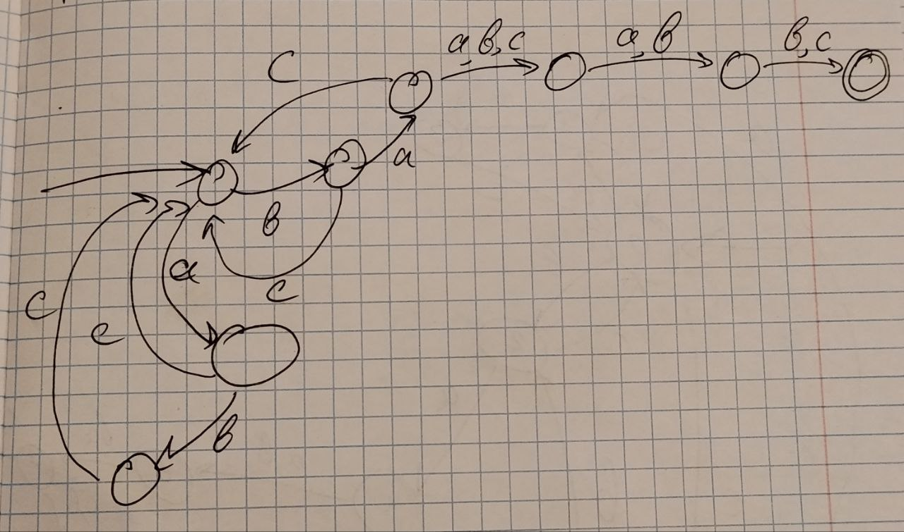
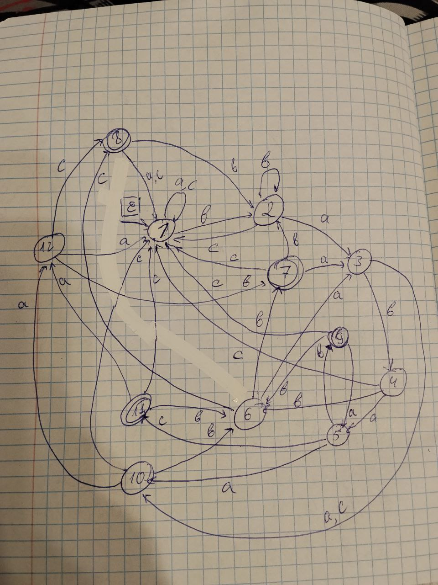
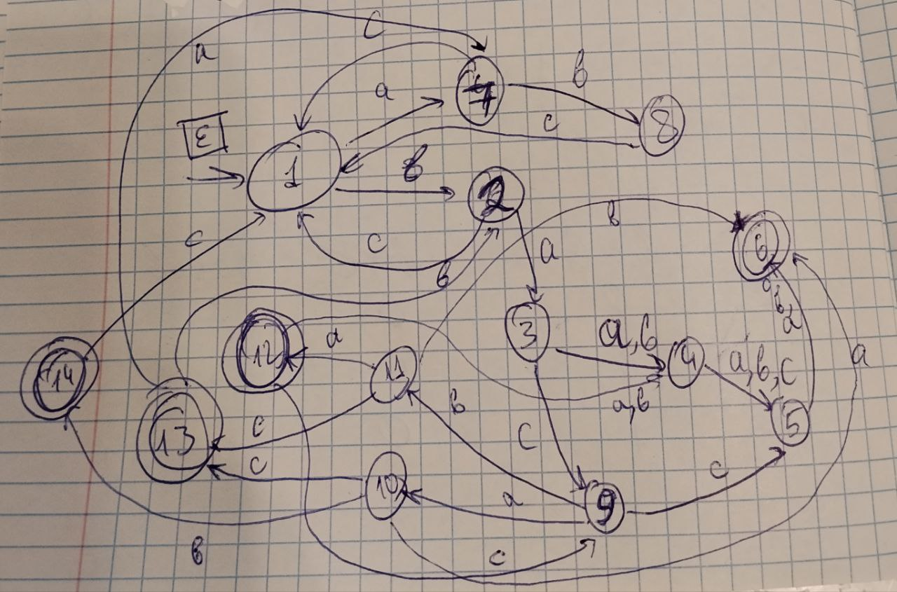

# Лабораторная работа №2

## Задание: 

По имеющемуся академическому регулярному выражению построить:

1. Минимальный ДКА, распознающий ее язык (минимальность обосновать таблицей классов эквивалентности)
2. Возможно малый НКА, возможно малый ПКА, распознающий ее язык (частично обосновать через таблицы множеств классов эквивалентности)
3. Расширенное регулярное выражение, распознающее тот же язык
4. Провести автоматическое тестирование предполагаемой эквивалентности

Выражение: $(abc|bc|ac|bac)^*ba(a|b|c)(a|b)(b|c)$

### 1. Построить ДКА и обосновать минимальность через таблицу классов эквивалентности

Построенный ДКА на 13 состояний:

Таблица классов эквивалентности:

|        | ε | c | bb | bbc | cbabab | acbaabc | bcbaabc |
|--------|---|---|----|-----|--------|---------|---------|
| ε      | 0 | 0 | 0  | 0   | 0      | 1       | 1       |
| a      | 0 | 0 | 0  | 0   | 1      | 0       | 1       |
| b      | 0 | 0 | 0  | 0   | 1      | 1       | 0       |
| ab     | 0 | 0 | 0  | 0   | 1      | 0       | 0       |
| ba     | 0 | 0 | 0  | 1   | 1      | 0       | 0       |
| bac    | 0 | 0 | 1  | 0   | 0      | 1       | 1       |
| bab    | 0 | 0 | 1  | 0   | 0      | 0       | 0       |
| bacb   | 0 | 1 | 0  | 0   | 1      | 1       | 0       |
| baca   | 0 | 1 | 0  | 0   | 1      | 0       | 1       |
| babb   | 0 | 1 | 0  | 0   | 0      | 0       | 0       |
| bacab  | 1 | 0 | 0  | 0   | 1      | 0       | 0       |
| bacac  | 1 | 0 | 0  | 0   | 0      | 1       | 1       |
| bacbb  | 1 | 0 | 0  | 0   | 0      | 0       | 0       |

### 2. НКА

Построенный НКА на 8 состояний. Недетерминизм возникает при обработке части $ba$, которая может быть в конце при $baXYZ$ и входить в $(bac|bc|ac|abc)^*$

Можно обосновать минимальность построенного НКА таблицей: 

|       | ε | babbb | bcbacac | aaac | abc | cbaaab | bb | c |
| ----- | - | ----- | ------- | ---- | --- | ------ | -- | - |
| bacac | 1 | 1     | 1       | 0    | 0   | 0      | 0  | 0 |
| ac    | 0 | 1     | 1       | 0    | 0   | 0      | 0  | 0 |
| a     | 0 | 0     | 1       | 0    | 0   | 1      | 0  | 0 |
| b     | 0 | 0     | 0       | 1    | 0   | 1      | 0  | 0 |
| ba    | 0 | 0     | 0       | 0    | 1   | 1      | 0  | 0 |
| ab    | 0 | 0     | 0       | 0    | 0   | 1      | 0  | 0 |
| baa   | 0 | 0     | 0       | 0    | 0   | 0      | 1  | 0 |
| babb  | 0 | 0     | 0       | 0    | 0   | 0      | 0  | 1 |

### 3. ПКА

Для построения ПКА представим регулярное выражение в виде пересечения двух языков. Нам необходима неизменяемая часть $ba$ как основа, а окончание и начало мы можем изменить

1. $L_1 = (a|b|c)^*ba(a∣b∣c)(a∣b)(b∣c)$ (случайное начало, а конец как у нашего языка)

2. $L_2 = (abc|bc|bac|ac)^*ba(a|b|c)^3$ (начало как у нашего языка, но случайный конец ровно из 3-х букв)

ПКА строим как объединение по $ε$ переходам в $q_1$ $L_1$ и $q_1$ $L_2$ соответственно

Таблица:

|      | ε | acbaaab | c | cbabab |
|------|---|---------|---|--------|
| bacb | 0 |  1      | 1 |  1     |
| baca | 0 |  0      | 1 |  1     |
| ba   | 0 |  0      | 0 |  1     |
| bab  | 0 |  0      | 0 |  0     |

### 4. Расширенная регулярка

^(ab?c|ba?c)*ba.[ab][bc]$

#### Пояснение эквивалентности регулярных выражений:

1. Итерационный блок переписан как объединение вариантов abc и ac, bac и bc
2. (a|b|c) в алфавите {a, b, c} заменен на .
