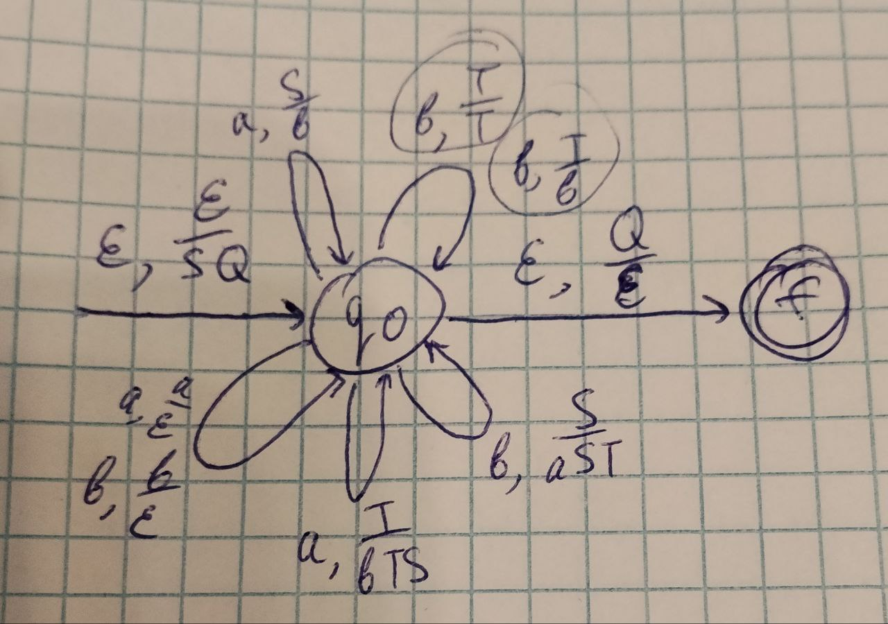
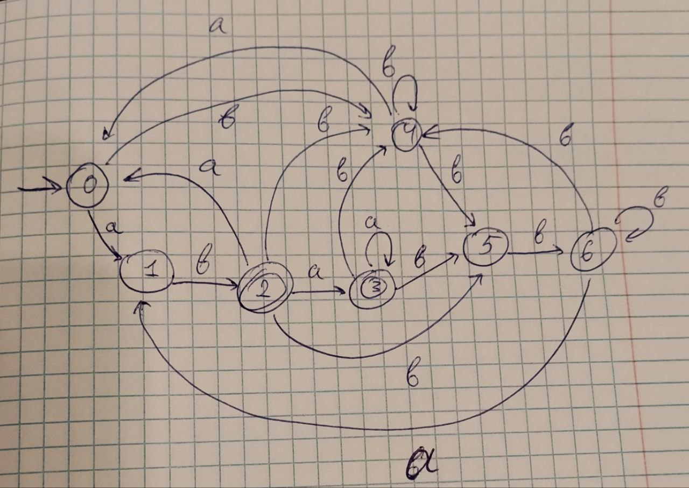
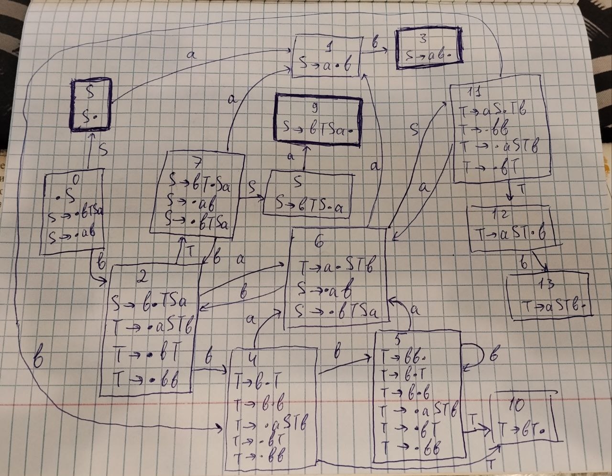

## Лабораторная работа №3 

Дана грамматика: 

* $S \to bTSa$
* $T \to aSTb$
* $S \to ab$
* $T \to bT$
* $T \to bb$
 
#### Анализ на детерминизм

Построим PDA: 

Недетерминизм возникает только при чтении $b$ с вершиной стека $T$
Можно:
* рекурсивно добавлять $T \to bT$
* один раз добавить $T \to bb$

##### Докажем недетерминизм по лемме о накачке

* Для любых двух слов $xy, xz∈L$ с общим длинным префиксом $x$ существует синхронная накачка такая что $α_1​α_2^i​α_3​y∈L `&` α_1​α_2^i​α_3z∈L$
* Существует разбиение $x=x_1x_2x_3$, $y=y_1y_2y_3$, $z=z_1z_2z_3$ такое что $|x_2x_3| \le p, |x_2| > 0 и x_1x_2^ix_3y_1y_2^iy_3∈L `&` x_1x_2^ix_3z_1z_2^iz_3∈L$

Возьмем регулярный язык $R = b(ab)^+bb(ababbb)^+bbb(ababbb)^*aba$
После пересечения $L \cap R$ получим язык $L_1$, который оставляет в языке только слова вида $S \to bTSa \to baSTbaba \to babTSaTbaba \to babaSTbSaTbaba \to bababTSaTbSaTbaba \to b(ab)^nT(SaTb)^naba \to b(ab)^nT(ababbb)^naba$

Рассмотрим два слова:

Первое раскрываем, пользуясь правилами
* $T \to bb$
Получим
* $w = b(ab)^nbb(ababbb)^nbbbaba$

Второе раскроем, пользуясь правилами
* $T \to bT$
* $T \to aSTb$
* $S \to bTSa$
* $S \to ab$
Получим
* $b(ab)^nbbT(ababbb)^naba \to b(ab)^nbbaSTb(ababbb)^naba \to b(ab)^nbbabTSaTb(ababbb)^naba \to b(ab)^nbbabaSTbSaTb(ababbb)^naba \to b(ab)^nbbababTSaTbSaTb(ababbb)^naba \to b(ab)^nbbababT(SaTb)^2(ababbb)^naba \to b(ab)^nbbababT(ababbb)^2(ababbb)^naba \to b(ab)^nbb(ababbb)^kbbb(ababbb)^{2k}(ababbb)^naba$
* $w' = b(ab)^nbb(ababbb)^kbbb(ababbb)^{2k}(ababbb)^naba$

После пересечения с регуляркой:

* В слове $w$ количество блоков $ababbb$ фиксирована, поэтому любая накачка меняет число блоков, т.е. слово выпадает из $L_1$
* В слове $w'$ можно менять количество $ababbb$ и не выпадать из языка

Тогда возникает противоречие, где $w$ выпадает, а $w'$ остается, значит **язык не является детерминированным.**

#### Анализ на беспрефиксность

Возьмем следующие правила:
* $T \to bT$
* $T \to bb$
* $S \to ab$
* $S \to bTSa$

Пусть 
$w_1 = b^6aba$ ($S \to bTSa \to bbTSa \to bbbTSa \to bbbbTSa \to bbbbbbaba$)

$w_2 = b^6abaa$ ($S \to bTSa \to bTbTSaa \to bbbbbbabaa$)

Тогда $w_2 = w_1aw_1$, значит $w_1$ является префиксом для $w_2$. **Язык не является беспрефиксным.**

#### Язык не обладает LL-свойством, так как он недетерминирован

#### LL(1)-аппроксимация

Построим $First$, $Follow$ и $Last$ множества

* $S \to b_1TSa_1$
* $T \to a_2STb_2$
* $S \to a_3b_3$
* $T \to b_4T$
* $T \to b_5b_6$

$First(G) = b_1, a_3$

$Follow(a_1) = a_1, b_4, b_5$

$Follow(b_1) = a_2, b_4, b_5$

$Follow(a_2) = b_1, a_3$

$Follow(b_2) = b_1, b_2, a_3$

$Follow(a_3) = b_3$

$Follow(b_3) = a_1, a_2, b_4, b_5$

$Follow(b_4) = a_2, b_4, b_5$

$Follow(b_5) = b_6$

$Follow(b_6) = b_1, a_3, b_2$

$Last(G) = a_1, b_3$

Получаем LL(1)-аппроксимацию и минимизируем её:

#### LR(0)-аппроксимация

Позиционный автомат

[Правила из пересечений грамматики с LL(1) и LR(0) тут](intersect_rules)

