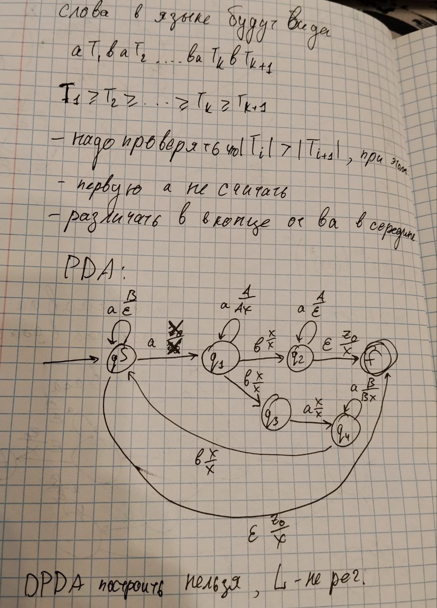

Ниже новый PDA для 3 задачи

# Обоснование построений:
1. Надо проверять, что блоки $aa$ невозрастают после каждого $b$. Для этого в стек будем помещать при встрече $a$ либо A либо B в зависимости от проверяемого блока (если положили A, то снимаем пока в стеке будут сверху А)
2. Если количество $b$ четно, то надо класть сверху B, а так же проверить что A>B. Только затем можно проверить, что блок после последней $b$ состоит из $a$, которых $\le$B
3. Первый $a$ или $a$ после $b$ при наличии ещё $b$ в строке не должны учитываться